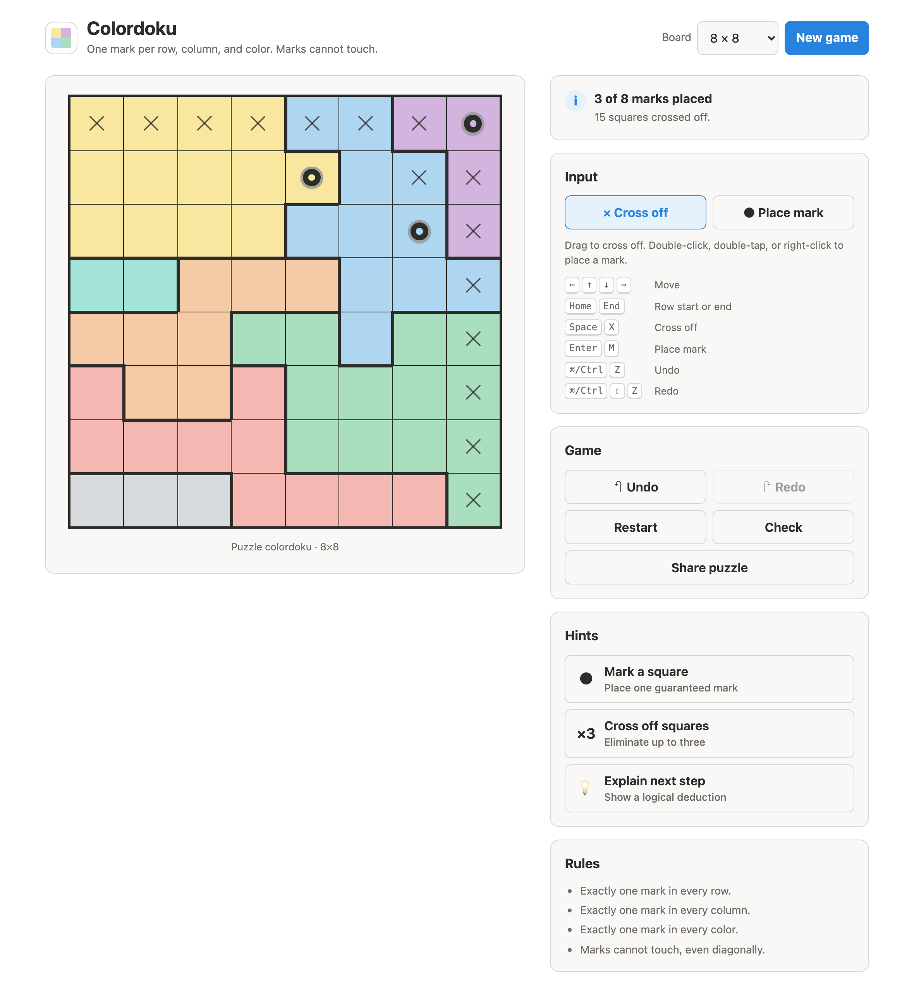

<p align="center">
  
</p>

<h1 align="center">Colordoku</h1>

<p align="center">A color-region logic puzzle for your browser. Place one mark in every row, column, and color, and never let two marks touch.</p>

<p align="center"><a href="https://omgreenfield.github.io/colordoku/"><strong>Play Colordoku →</strong></a></p>

<p align="center">
  <a href="https://github.com/omgreenfield/colordoku/actions/workflows/pages.yml"></a>
  <a href="LICENSE"></a>
</p>

<picture>
  <source media="(prefers-color-scheme: dark)" srcset="docs/images/screenshot-dark.png" />
  
</picture>

## Contents

- [How to play](#how-to-play)
- [Controls](#controls)
- [Features](#features)
- [How it works](#how-it-works)
- [Development](#development)
- [Deployment](#deployment)
- [License](#license)

## How to play

The board is split into as many colored regions as it has rows. Place marks so that:

- every row has exactly one mark
- every column has exactly one mark
- every color has exactly one mark
- no two marks touch, not even diagonally

Every puzzle has exactly one solution. Cross off squares that can't hold a mark, then place marks where only one choice is left.

## Controls

| Action                 | Mouse                       | Touch                                   | Keyboard                                                                        |
| ---------------------- | --------------------------- | --------------------------------------- | ------------------------------------------------------------------------------- |
| Cross off or clear     | Click                       | Tap                                     | <kbd>Space</kbd> or <kbd>X</kbd>                                                |
| Cross off many         | Click and drag              | Drag                                    |                                                                                 |
| Place or remove a mark | Double-click or right-click | Double-tap, or switch to **Place mark** | <kbd>Enter</kbd> or <kbd>M</kbd>                                                |
| Move between squares   |                             |                                         | Arrow keys, <kbd>Home</kbd>, <kbd>End</kbd>                                     |
| Undo                   | **Undo** button             | **Undo** button                         | <kbd>⌘/Ctrl</kbd> <kbd>Z</kbd>                                                  |
| Redo                   | **Redo** button             | **Redo** button                         | <kbd>⌘/Ctrl</kbd> <kbd>Shift</kbd> <kbd>Z</kbd> or <kbd>Ctrl</kbd> <kbd>Y</kbd> |

## Features

- Fresh puzzles in four sizes, from 6×6 to 9×9, each with exactly one solution
- Shareable puzzle links: every puzzle has a seed in its URL, so `?size=8&seed=k3f9x2` rebuilds the same board on any device
- Three hints: place a guaranteed mark, cross off up to three squares, or explain the next logical step, with the hint's squares highlighted on the board
- Undo and redo for every move, including Restart
- A live status that tells you as soon as a cross-off makes the puzzle impossible
- Light and dark themes that follow your system
- Keyboard play and screen reader labels for every square
- No build step, no runtime dependencies, and no tracking

## How it works

- **Seeds.** Every random choice comes from a [mulberry32](https://gist.github.com/tommyettinger/46a874533244883189143505d203312c) generator seeded with an FNV-1a hash of the puzzle's seed, so the same size and seed produce the same puzzle everywhere.
- **Solution first.** The generator picks one column per row with a randomized backtracking search, rejecting columns that repeat or touch the row above.
- **Growing regions.** Each solution square starts its own color. Empty squares next to a color join it one at a time in random order, and a square only joins a color if the puzzle still has exactly one solution afterward.
- **Solving.** A row-by-row backtracking solver honors crossed-off squares and marks, and stops after two solutions, which is all the uniqueness check needs.
- **Explaining the next step.** The reasoning hint looks for the deduction a person would make, simplest first: squares a mark already rules out; colors whose open squares fit in exactly as many rows or columns as there are colors, which locks every other color out of those lines; and finally proof by contradiction.

## Development

You need Node 22 or newer (`.nvmrc` pins 24).

```bash
npm install
npm start
```

`npm start` serves the game at http://localhost:8000. The site is plain ES modules and CSS, so edit a file and reload. Opening `site/index.html` straight from disk doesn't work, because browsers block module scripts on `file://`.

| Command          | What it does                                                      |
| ---------------- | ----------------------------------------------------------------- |
| `npm test`       | Runs the game logic tests with Node's built-in test runner        |
| `npm run check`  | Lint, format check, type check, and tests, as CI runs them        |
| `npm run format` | Formats everything with Prettier                                  |
| `npm run images` | Regenerates the preview image, touch icon, and README screenshots |

`npm run images` drives your installed Google Chrome. Set `CHROME_PATH` if it isn't in the default macOS location.

```
site/                 served to GitHub Pages as is
├── index.html
├── css/              tokens, layout, board, panels
├── js/game/          puzzle logic with no DOM access
├── js/ui/            board, panels, links
├── js/main.js        wires the game to the page
└── assets/           icons and the link-preview image
test/                 unit tests for the game logic
scripts/              image capture
docs/images/          README screenshots
```

Types live in JSDoc comments, and `npm run typecheck` checks them with TypeScript.

## Deployment

Every push to `main` runs the checks and then deploys `site/` to GitHub Pages with GitHub Actions. Pull requests and other branches run the same checks without deploying.

## License

[MIT](LICENSE) © 2026 Matthew Greenfield. Inspired by the Queens puzzle on LinkedIn; Colordoku isn't affiliated with LinkedIn.
